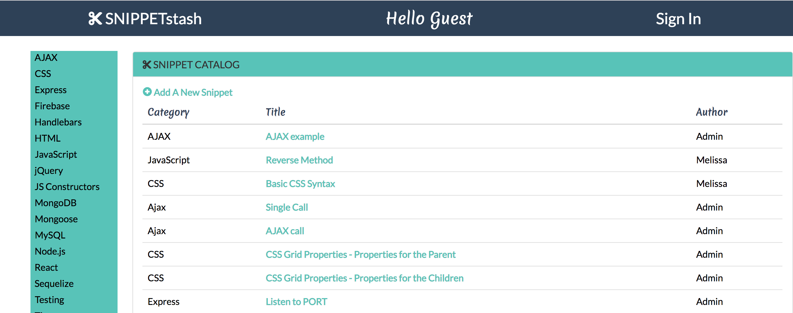

# Snippet-Stash-React
Deployed here: https://snippetstash-mern.herokuapp.com/

## SnippetStash Version 2
A code snippet and boilerplate library for new coders
* Revamped with ReactJS from version 1
* Version 1 can be viewed here:
https://snippet-stash.herokuapp.com/

## SnippetStash 2.0
* To provide a database for coders to find communal code snippets and create/save their own library of snippets for future use.
* A user can create an account and login
* For the pupose of storing personal snippets of code and making comments about their code.
* Solves the problem of creating a space to store and share boilerplate code and useful, helpful and fascinating snippets of CODE.

### Technologies Used
* Uses ReactJS 
* Uses a Node and Express Web Server
* Backed by a MongoDB Database with a Mongoose ORM  
* Has both GET and POST routes for retrieving and adding new data
* Deployed using Heroku (with Data)
* Utilized the following libraries and technologies:
    * ClipboardJS 
    * React-CodeMirror
    * Flexbox (CSS)
   

